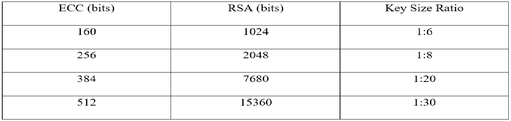

# An Enhancement of Data Security in Third-party Storage with an Implementation of Hybrid AES-ECC algorithm

# A. Overview 
A cloud computing environment provides a cost-effective way for the end user to store and access private data over remote storage using some Internet connection. The user has access to the data anywhere and at any time.

    

However, the data over the cloud do not remain secure all the time. Since the data are accessible to the end user only by using the interference of a third party, it is prone to breach of authentication and integrity of the data.

    

Moreover, cloud computing allows simultaneous users to access and retrieve their data online over different Internet connections, which leads to the exposure, leakage, and loss of a user’s sensitive data in different locations.

# B. About our Project.
## 1. Overall
### 1.1. Scenarios.
In general, the context that we are aiming for is the storage of private (or secret) information on a cloud service (such as Google Drive, One Drive, AWS,...). Unfortunately this may present some security risks such as:

    

- Insider Threats: Malicious employees or contractors who have access to the cloud storage system can steal or leak sensitive data.
- Data Breaches: If the cloud storage provider's security measures are not adequate, hackers can gain access to sensitive data stored in the cloud.

Here is the history of Major Cloud Security attacks:

    

### 1.2. Assets that need to be protected in the above scenarios.
Any digital assets that the users want to upload to the cloud!
- User data such as private image, video, email,...
- In case the user is a business or a company, the assets to be protected include: transaction information, personal information of customers, business partners,...

### 1.3. Related party.
- Assets owner (personal or business users)
- Cloud service (Google Drive, One Drive, Dropbox,...)
- Adversaries (internal or external)

### 1.4. Security goal.
Our security goal is to pass private data through the cloud space in a secure way, preventing third parties or intruders from accessing or making meaningful information out of the data being passed through the cloud space.

## 2. Our solutions
We propose an enhanced data security model using a two-level (Hybrid) cryptographic technique symmetric (AES) and asymmetric (ECC) cryptographic technique. 

    

- Step 1: Key exchange using ECDH to create shared-key (both sender and receiver side).

    

- Step 2: Using shared-key to perform AES encryption on original data (sender side).

- Step 3: Using ECDSA to sign ciphertext and append the signature to ciphertext. Then upload `CIPHERTEXT||SIGN` to cloud server (sender side).

    

- Step 4: Receiver request download file from cloud then using sender's public key to verify ciphertext (receiver side).

- Step 5: If the ciphertext was verified then receiver use shared-key to decrypt and obtain original data from sender (receiver side).

## 3. Summary
Our proposed scheme has solved some security problem:
- **Confidentiality**: The ECDH key exchange for producing Shared Key then perfomming AES encryption makes it totally impossible for third parties or attackers to produce same key in decrypting the data
- **Integrity**: The integrity of the data is also maintained by the usage of the ECDSA which allows for the integrity check of the data.
- **High efficiency**:
    - ECDH is considered to be one of the most efficient key exchange schemes as it provides a high level of security with a small key size:
 
    

        
    

    
    - AES is considered to be one of the most efficient ciphers for encrypting large amounts of data due to its high level of security and speed

Duty roster:

| Name              | ID        |  Presentation    | Cloud storage idea   | Searching Paper | Virtualize scheme | Demo |
|:-----------------:|:---------:|:----------------:|:--------------------:|:---------------:|:-----------------:|:----:|
| Võ Nguyên Chương  | 21520011  |       X          |                      |        X        |       X           |  X   |
| Nguyễn Hữu Dương  | 21520757  |                  |           X          |                 |       X           |  X   |

# C. Propose for Implementation
Create secure chatbox (or file transformation) application (using C# or python) to demo our proposed scheme:

Some provided features:
- Secure key exchange using ECDH to create shared-key through insecure channel.
- Encrypt data using AES algorithm (with shared-key) before transforming.
- Signing and verifying data using ECRSA and SHA-256.

# D. References

- [[1]](https://www.ijert.org/research/an-enhancement-of-data-security-in-cloud-computing-with-an-implementation-of-a-two-level-cryptographic-technique-using-aes-and-ecc-algorithm-IJERTV9IS090344.pdf) Hodowu, D., Korda, D. R., & Ansong, E. D. (2020, September 26). An Enhancement of Data Security in Cloud Computing with an Implementation of a Two-Level Cryptographic.
- [[2]](https://www.mdpi.com/2079-9292/10/21/2673) Rehman, S., Bajwa, N. U. H., Shah, M. A., Aseeri, A. O., & Anjum, A. (2021). Hybrid AES-ECC Model for the Security of Data over Cloud Storage. Electronics, 10(21), 2673.